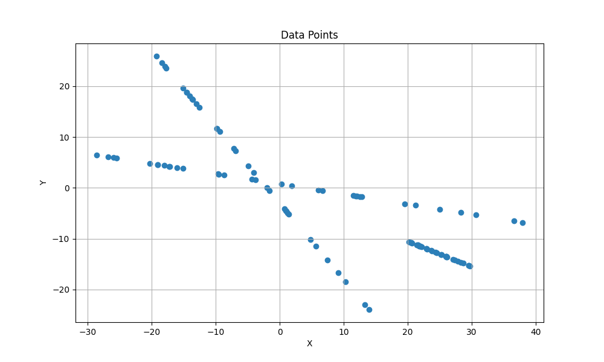
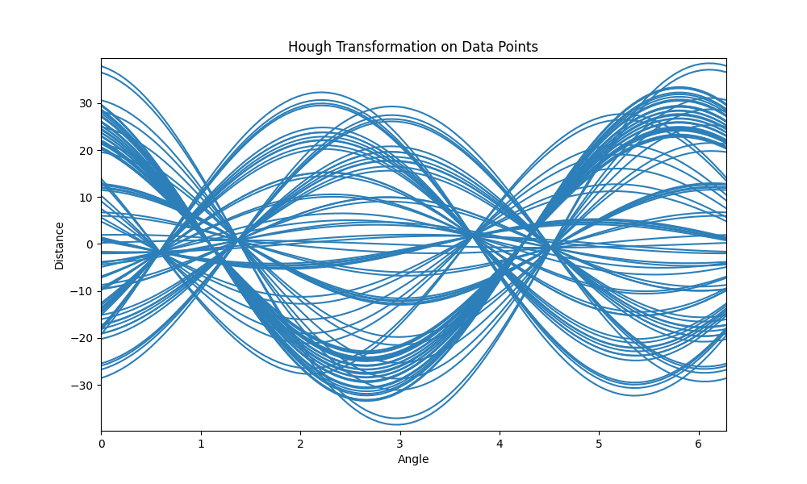
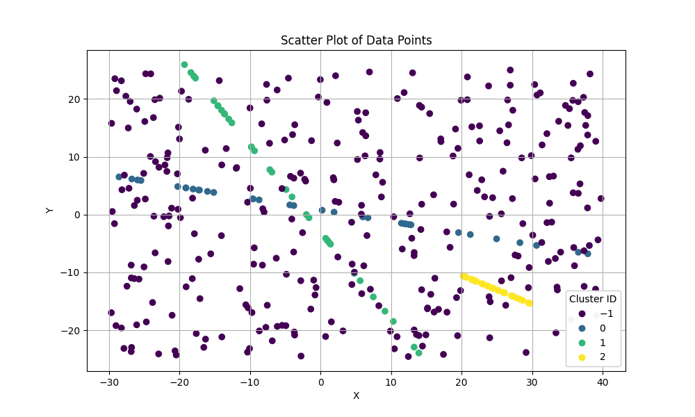

# CASH

This Repository implements the declarative version of the CASH (Clustering in Arbitrary Subspaces based on the Hough Transform) Algorithm.

## Overview

The CASH algorithm is a powerful tool for identifying clusters within high-dimensional data. By leveraging the Hough Transform, CASH can detect clusters in arbitrarily oriented subspaces, making it particularly effective in scenarios where traditional clustering methods fall short. This capability is crucial for applications such as market trend analysis, where patterns may not align with the primary dimensions of the dataset.

## How It Works

1. **Data Mapping**: Points from a high-dimensional data space are mapped to sinusoidal functions in a new parameter space. For example, the images below show how the data points are mapped to functions.




2. **Identification of Regions of Interest**: Intersections between curves in parameter space represent a straight line in data space that runs through the points of the correlating curves. Dense regions in the parameter space, which correspond to potential clusters (representing linear correlations) in the data space, are identified.
3. **Cluster Model Derivation**: A cluster model is derived for each identified region.
4. **Cluster Formation**: The identified clusters are validated and formed based on the derived models. An example of clustering with CASH is shown in the following figure. The algorithm is able to deal with a large amount of noise.



## Applications of CASH

The CASH Algorithm is particularly useful for identifying linear trends, which is useful for various application areas, such as:

### Identifying Market Trends

- Efficiently detect patterns across multiple dimensions, such as sales, time, and location, using SQL.
- Uncover hidden correlations that may not be immediately apparent in the original data dimensions.
- Provide insights into complex datasets, enabling better decision-making and strategy development without extensive computational overhead.

### Finance

- Sales forecasting by identifying sales trends in companies to support financial planning.
- Recognizing cost trends in order to improve the management of expenditure.

### Energy and Resources

- Analyzing energy consumption trends in order to predict future energy requirements.
- Recognizing areas where energy is wasted and suggesting measures for improvement.

## Getting Started

To get started with the CASH algorithm, follow these steps:

1. Ensure that Python 3.9.0 and PostgreSQL 14 are installed.
2. Configure `src/settings.py`.
3. Virtual Environment: to create an isolated environment for this project, use the following command:
    ```sh
    virtualenv venv
    ```
4. To activate the virtual environment, run:
   - On Windows: 
     ```sh
     .\venv\Scripts\activate
     ```
   - On Unix or MacOS:
     ```sh
     source .venv/bin/activate
     ```
5. Install necessary packages:
    ```sh
    pip install -r requirements.txt
    ```
6. Update Environment with new requirements:
    ```sh
    pip freeze > requirements.txt
    ```

   (To remove unused packages: `pipreqs --force .`)
